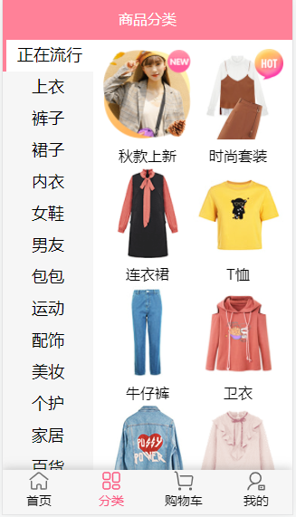
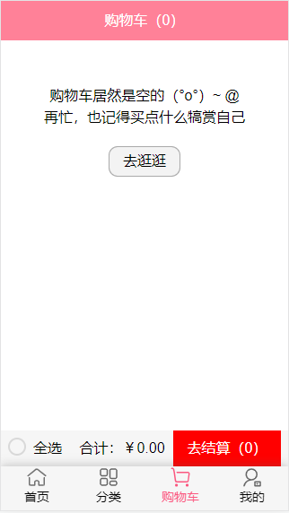
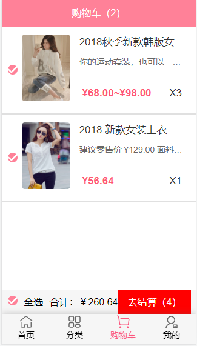

# supermall

### 1.简介
> * 基于vue-cli4搭建的前后端分离的商城项目
> * 包含商城主页，商品详情页，商品分类页，个人中心等模块
> * 熟悉使用Vue、Vue-Router、Vuex、Axios、Webpack等前端技术
> * 使用Better-Scroll更好地实现滚动效果
> * 通过Vue懒加载、防抖节流优化性能
> * 实现组件封装，模块化开发

### 2. 项目展示
###### 1）商品主页

###### 2）商品详情页

###### 3）分类页

###### 4）购物车部分

### 4.踩坑记录
> 1） Better-Scroll 设置时 一定要注意wrapper的高度小于content的高度，否则滑动无效果
> 2） 使用position对wrapper进行定位时top和bottom是一定要定义的
> 3） 路由路径映射里是component不是components
> 
> 其实还有很多踩坑，一下子实在没想起，下回再更新。项目还有不足，将会一直更新的哟~ 
> network的request.js里写数据接口，记得修改~~

